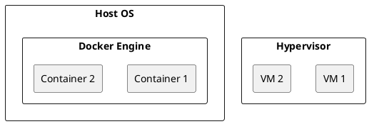

# What is Docker?

Docker is a platform that packages applications into containers.

Containers include:
- Application code
- Runtime
- Dependencies
- System libraries

## Why Docker?

It solves the "works on my machine" problem.

## Container vs VM

## Summary

Docker enables portable, consistent deployments.

------------------------------------------------------------------------

## References

- https://docs.docker.com/get-started/
