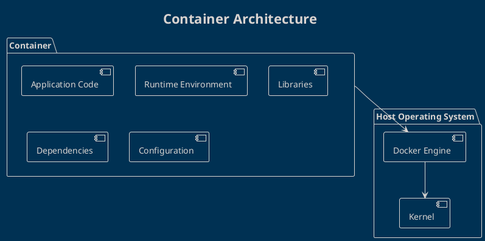
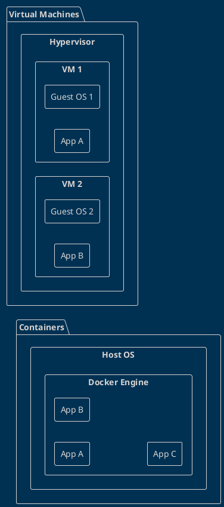

# What is Docker?

Have you ever heard "*It works on my machine*" and wondered why software behaves differently on different computers? Docker solves this age-old problem.

**Docker** is a containerization platform that packages applications with all their dependencies into lightweight, portable containers.

## The Problem Docker Solves

Before Docker, applications often failed when moved between environments because of:
- Different operating system versions
- Missing libraries or dependencies  
- Configuration differences
- Runtime environment mismatches

## What is a Container?

Think of a container as a **lightweight, portable box** that contains:
- Your application code
- Runtime environment (Node.js, Python, etc.)
- System libraries
- Dependencies and packages
- Configuration files



## Containers vs Virtual Machines

| Aspect | Containers | Virtual Machines |
|--------|------------|------------------|
| **Resource Usage** | Lightweight (MB) | Heavy (GB) |
| **Startup Time** | Seconds | Minutes |
| **Isolation** | Process-level | Hardware-level |
| **OS** | Shares host OS | Full OS per VM |



## Key Benefits

**Portability**: Run anywhere Docker runs  
**Performance**: Near-native performance  
**Consistency**: Same behavior across environments  
**Efficiency**: Better resource utilization  
**Scalability**: Easy horizontal scaling

## Real-World Example

Imagine you built a web application using:
- Node.js 18
- Express.js framework
- MongoDB database
- Specific npm packages

Without Docker, deploying this app requires:
1. Installing Node.js 18 on the server
2. Installing MongoDB
3. Installing all npm dependencies
4. Configuring environment variables
5. Hope nothing conflicts!

With Docker, you package everything into a container and just run:
```bash
docker run myapp
```

**Result**: Your app runs identically everywhere!

---

## What's Next?

Ready to get hands-on? In the next article, we'll install Docker and run your first container!

## References
- [Docker Official Documentation](https://docs.docker.com/get-started/)
- [Docker Hub - Container Registry](https://hub.docker.com/)
