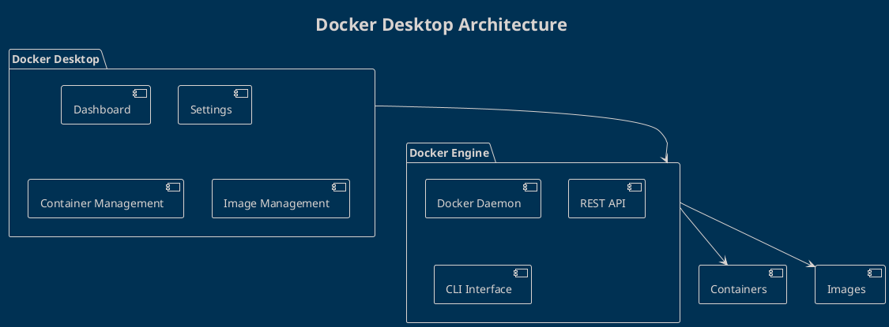

# Installing Docker Desktop

Ready to start your Docker journey? Let's get Docker installed on your system!

Docker Desktop provides an easy way to run Docker on your development machine with a user-friendly interface.

## System Requirements

### macOS
- macOS 10.15 or later
- 4GB RAM minimum
- Apple Silicon (M1/M2) or Intel processor

### Windows  
- Windows 10/11 64-bit
- WSL 2 enabled
- 4GB RAM minimum
- Virtualization enabled in BIOS

### Linux
- 64-bit Ubuntu, Debian, CentOS, or Fedora
- 4GB RAM minimum

## Installation Steps

### macOS Installation

1. **Download Docker Desktop**
   ```bash
   # Visit https://docker.com/products/docker-desktop
   # Or use Homebrew
   brew install --cask docker
   ```

2. **Install and Launch**
   - Run the installer
   - Drag Docker to Applications folder
   - Launch Docker Desktop
   - Accept the service agreement

3. **Verify Installation**
   ```bash
   docker --version
   # Output: Docker version 24.0.7, build afdd53b
   
   docker run hello-world
   # Should download and run successfully
   ```

### Windows Installation

1. **Enable WSL 2**
   ```powershell
   # Run as Administrator
   wsl --install
   # Restart your computer
   ```

2. **Download and Install**
   - Download from [docker.com](https://docker.com/products/docker-desktop)
   - Run the installer with admin privileges
   - Choose "Use WSL 2" during setup

3. **Verify Installation**
   ```cmd
   docker --version
   docker run hello-world
   ```

### Linux Installation

#### Ubuntu/Debian
```bash
# Update package index
sudo apt update

# Install Docker
sudo apt install docker.io

# Add user to docker group
sudo usermod -aG docker $USER

# Start Docker service
sudo systemctl start docker
sudo systemctl enable docker

# Log out and back in, then verify
docker --version
docker run hello-world
```

#### CentOS/RHEL
```bash
# Install Docker
sudo yum install docker

# Start Docker service  
sudo systemctl start docker
sudo systemctl enable docker

# Add user to docker group
sudo usermod -aG docker $USER

# Verify installation
docker --version
docker run hello-world
```

## Verification Tests

After installation, run these commands to ensure everything works:

```bash
# Check Docker version
docker --version

# Check Docker Compose version
docker-compose --version

# Run test container
docker run hello-world

# Check Docker system info
docker system info

# List running containers (should be empty initially)
docker ps
```

## Expected Output

When you run `docker run hello-world`, you should see:

```
Hello from Docker!
This message shows that your installation appears to be working correctly.

To generate this message, Docker took the following steps:
 1. The Docker client contacted the Docker daemon.
 2. The Docker daemon pulled the "hello-world" image from the Docker Hub.
 3. The Docker daemon created a new container from that image.
 4. The Docker daemon streamed that output to the Docker client.
```

## Troubleshooting Common Issues

### Permission Denied (Linux)
```bash
# Add user to docker group
sudo usermod -aG docker $USER
# Log out and back in
```

### WSL 2 Issues (Windows)
```bash
# Update WSL 2 kernel
wsl --update
# Restart Docker Desktop
```

### Resource Issues
- Increase RAM allocation in Docker Desktop settings
- Free up disk space (Docker needs ~2GB)

## Docker Desktop Interface

Docker Desktop provides:
- **Dashboard**: View running containers and images
- **Settings**: Configure resources and preferences  
- **Dev Environments**: Integrated development environments
- **Extensions**: Additional tools and integrations



## What's Next?

**Congratulations!** You now have Docker installed and ready to use.

In the next article, we'll explore Docker images and containers - the core building blocks of Docker.

---

## References
- [Docker Desktop Installation Guide](https://docs.docker.com/desktop/)
- [Docker Engine Installation](https://docs.docker.com/engine/install/)
- [WSL 2 Setup Guide](https://docs.microsoft.com/en-us/windows/wsl/install)
