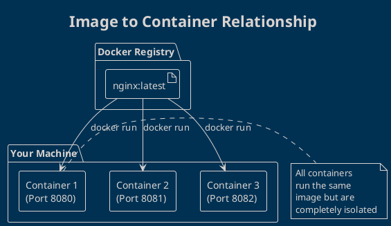
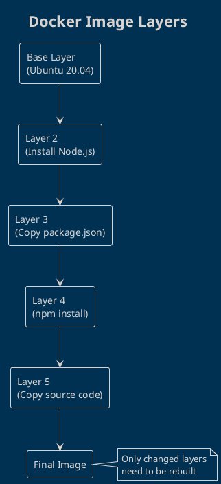
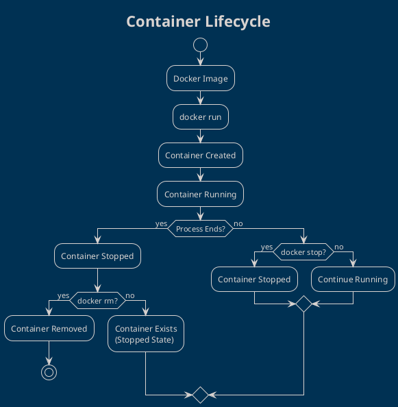

# Docker Images and Containers Explained

Understanding the relationship between **images** and **containers** is crucial for mastering Docker. Think of it like this:

> **Image** = Recipe   
> **Container** = Cooked Dish 

## What is a Docker Image?

A **Docker image** is a lightweight, standalone, executable package that includes:
- Application code
- Runtime environment  
- Libraries and dependencies
- Environment variables
- Configuration files

**Key characteristics:**
- **Immutable** - Images never change once built
-  **Layered** - Built in layers for efficiency
- **Portable** - Can run on any Docker-enabled system

## What is a Docker Container?

A **container** is a **running instance** of an image. Multiple containers can run from the same image simultaneously.

**Key characteristics:**
- **Live Process** - Active, running application
-  **Mutable** - Can be modified while running
- **Isolated** - Has its own filesystem, network, and process space

## Visual Relationship



## Practical Examples

### Example 1: Running NGINX Web Server

```bash
# Pull the nginx image from Docker Hub
docker pull nginx:latest

# List downloaded images
docker images

# Run a container from the nginx image
docker run -d -p 8080:80 --name my-web-server nginx:latest

# Check running containers
docker ps
```

**What happens:**
1. `docker pull` downloads the nginx image
2. `docker run` creates and starts a container from that image
3. `-d` runs it in detached mode (background)
4. `-p 8080:80` maps port 8080 on your machine to port 80 in container
5. `--name` gives the container a friendly name

### Example 2: Multiple Containers from Same Image

```bash
# Run multiple nginx containers on different ports
docker run -d -p 8080:80 --name web1 nginx:latest
docker run -d -p 8081:80 --name web2 nginx:latest  
docker run -d -p 8082:80 --name web3 nginx:latest

# All containers run independently
# Visit http://localhost:8080, http://localhost:8081, http://localhost:8082
```

## Image Layers Explained

Docker images are built in **layers**. Each instruction in a Dockerfile creates a new layer:



**Benefits of layering:**
- **Fast builds** - Only modified layers rebuild
- **Storage efficiency** - Layers are shared between images
- **Caching** - Docker caches layers for faster subsequent builds

## Common Docker Commands

### Image Commands
```bash
# List all images
docker images

# Search for images on Docker Hub
docker search python

# Pull an image
docker pull python:3.11

# Remove an image
docker rmi python:3.11

# Build image from Dockerfile
docker build -t my-app .
```

### Container Commands
```bash
# List running containers
docker ps

# List all containers (including stopped)
docker ps -a

# Run a container
docker run nginx

# Run container in background
docker run -d nginx

# Run container interactively
docker run -it ubuntu bash

# Stop a running container
docker stop container_name

# Start a stopped container
docker start container_name

# Remove a container
docker rm container_name
```

## Container Lifecycle



## Hands-On Exercise

Try this step-by-step exercise:

```bash
# 1. Pull Ubuntu image
docker pull ubuntu:latest

# 2. Run Ubuntu container interactively
docker run -it --name my-ubuntu ubuntu:latest bash

# 3. Inside the container, create a file
echo "Hello from Docker!" > /tmp/hello.txt
cat /tmp/hello.txt

# 4. Exit the container
exit

# 5. Start the container again
docker start my-ubuntu

# 6. Attach to the running container
docker attach my-ubuntu

# 7. Check if the file still exists
cat /tmp/hello.txt

# 8. Exit and clean up
exit
docker rm my-ubuntu
```

## Best Practices

### Do's
- Use official images when possible
- Keep images small and focused
- Use specific image tags (avoid `latest` in production)
- Clean up unused containers and images regularly

### Don'ts  
- Don't store data in containers (use volumes instead)
- Don't run multiple services in one container
- Don't build images with sensitive data
- Don't ignore security updates

## What's Next?

Now that you understand images and containers, let's put this knowledge to practice by running your first web server in the next article!

---

## References
- [Docker Images Documentation](https://docs.docker.com/engine/reference/commandline/images/)
- [Docker Containers Guide](https://docs.docker.com/engine/reference/commandline/container/)
- [Docker Hub Registry](https://hub.docker.com/)
