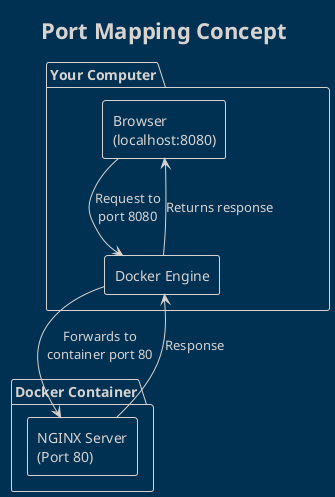

# Running Your First Web Server

Ready to deploy your first web server with Docker? Let's use NGINX, a popular web server, to see Docker in action!

## What is NGINX?

**NGINX** is a high-performance web server and reverse proxy server. It's perfect for serving static websites, APIs, and handling high traffic loads.

## Step 1: Pull the NGINX Image

First, let's download the official NGINX image from Docker Hub:

```bash
# Pull the latest NGINX image
docker pull nginx:latest

# Verify the image was downloaded
docker images | grep nginx
```

## Step 2: Run Your First Web Server

Now let's start a web server container:

```bash
# Run NGINX in detached mode with port mapping
docker run -d -p 8080:80 --name my-first-webserver nginx:latest

# Check if the container is running
docker ps
```

**Command breakdown:**
- `docker run` - Creates and starts a new container
- `-d` - Runs in detached mode (background)
- `-p 8080:80` - Maps port 8080 on your machine to port 80 in container
- `--name my-first-webserver` - Gives the container a friendly name
- `nginx:latest` - The image to use

## Step 3: Test Your Web Server

Open your web browser and visit: **http://localhost:8080**

You should see the NGINX welcome page!

```bash
# You can also test with curl
curl http://localhost:8080
```

## Understanding Port Mapping



**Why port mapping?**
- Containers have their own network
- Port 80 inside container ≠ Port 80 on your machine
- `-p 8080:80` creates a bridge between them

## Step 4: Serve Custom Content

Let's replace the default NGINX page with your own content:

### Method 1: Volume Mounting
```bash
# Create a custom HTML file
mkdir ~/my-website
echo "<h1>Hello from Docker!</h1><p>My first containerized website</p>" > ~/my-website/index.html

# Stop the current container
docker stop my-first-webserver
docker rm my-first-webserver

# Run with volume mount
docker run -d -p 8080:80 --name custom-webserver \
  -v ~/my-website:/usr/share/nginx/html \
  nginx:latest
```

### Method 2: Copy Files to Running Container
```bash
# Create custom content
echo "<h1>Updated Content!</h1>" > ~/index.html

# Copy file into running container
docker cp ~/index.html custom-webserver:/usr/share/nginx/html/index.html

# Refresh your browser to see changes
```

## Step 5: Container Management

Essential commands for managing your web server:

```bash
# View container logs
docker logs my-first-webserver

# Follow logs in real-time
docker logs -f my-first-webserver

# Execute commands inside the container
docker exec -it my-first-webserver bash

# Stop the web server
docker stop my-first-webserver

# Start it again
docker start my-first-webserver

# Remove the container completely
docker rm my-first-webserver
```

## Multiple Web Servers

You can run multiple web servers on different ports:

```bash
# Run multiple NGINX servers
docker run -d -p 8080:80 --name web1 nginx:latest
docker run -d -p 8081:80 --name web2 nginx:latest
docker run -d -p 8082:80 --name web3 nginx:latest

# Now you have 3 web servers:
# http://localhost:8080
# http://localhost:8081  
# http://localhost:8082
```

## Environment Variables

NGINX containers can be configured with environment variables:

```bash
# Run with custom configuration
docker run -d -p 8080:80 \
  --name configured-nginx \
  -e NGINX_HOST=mysite.local \
  -e NGINX_PORT=80 \
  nginx:latest
```

## Troubleshooting Common Issues

### Port Already in Use
```bash
# Error: port 8080 is already allocated
# Solution: Use a different port
docker run -d -p 8090:80 nginx:latest

# Or find and stop the conflicting container
docker ps
docker stop <container-name>
```

### Container Won't Start
```bash
# Check container logs for errors
docker logs <container-name>

# Check if the image exists
docker images | grep nginx
```

### Cannot Access Website
```bash
# Verify container is running
docker ps

# Check port mapping is correct
docker port <container-name>

# Test with curl
curl http://localhost:8080
```

## Performance Monitoring

Monitor your web server's performance:

```bash
# View resource usage
docker stats my-first-webserver

# View detailed container information
docker inspect my-first-webserver

# Check container processes
docker exec my-first-webserver ps aux
```

## Security Best Practices

**For production deployments:**

```bash
# Run as non-root user
docker run -d -p 8080:80 --user nginx nginx:latest

# Limit resources
docker run -d -p 8080:80 \
  --memory="256m" \
  --cpus="0.5" \
  nginx:latest

# Use read-only filesystem
docker run -d -p 8080:80 --read-only nginx:latest
```

## What's Next?

**Congratulations!** You've successfully:
- Deployed your first web server with Docker
- Understood port mapping
- Served custom content
- Learned container management basics

In the next article, we'll learn how to build custom Docker images using Dockerfile!

---

## References
- [NGINX Docker Hub](https://hub.docker.com/_/nginx)
- [Docker Run Command Reference](https://docs.docker.com/engine/reference/commandline/run/)
- [Docker Port Mapping Guide](https://docs.docker.com/config/containers/container-networking/)
