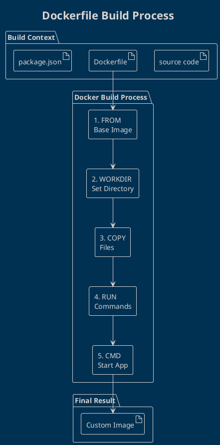

# Building Images with Dockerfile

Ready to create your own Docker images? A **Dockerfile** is a text file containing instructions to build a custom Docker image automatically.

Think of it as a **recipe** that tells Docker exactly how to prepare your application for containerization.

## What is a Dockerfile?

A **Dockerfile** is a script containing step-by-step instructions for Docker to:
- Choose a base operating system
- Install dependencies and tools  
- Copy your application files
- Set configuration and environment
- Define how to run your application

## Dockerfile Structure



## Essential Dockerfile Instructions

### FROM - Base Image
```dockerfile
# Use official Node.js runtime as base image
FROM node:18-alpine

# Use specific version for reproducibility  
FROM nginx:1.25.3-alpine

# Use Ubuntu for more control
FROM ubuntu:22.04
```

### WORKDIR - Set Working Directory
```dockerfile
# Set working directory inside container
WORKDIR /app

# All subsequent commands run from this directory
```

### COPY vs ADD
```dockerfile
# COPY (recommended) - simple file copying
COPY package.json ./
COPY src/ ./src/

# ADD - has additional features (tar extraction, URL download)
ADD https://example.com/file.tar.gz /tmp/
```

### RUN - Execute Commands
```dockerfile
# Install packages
RUN apt-get update && apt-get install -y curl git

# Install Node.js dependencies
RUN npm install

# Chain commands for efficiency
RUN apt-get update && \
    apt-get install -y python3 pip && \
    pip install requirements.txt
```

### CMD vs ENTRYPOINT
```dockerfile
# CMD - default command (can be overridden)
CMD ["node", "server.js"]
CMD ["npm", "start"]

# ENTRYPOINT - always executed (parameters appended)
ENTRYPOINT ["node", "server.js"]

# Combined usage
ENTRYPOINT ["node"]
CMD ["server.js"]
```

## Practical Example: Node.js Web App

Let's build a complete Node.js application image:

### 1. Create Application Files

**package.json**
```json
{
  "name": "docker-node-app",
  "version": "1.0.0",
  "scripts": {
    "start": "node server.js"
  },
  "dependencies": {
    "express": "^4.18.0"
  }
}
```

**server.js**
```javascript
const express = require('express');
const app = express();
const PORT = 3000;

app.get('/', (req, res) => {
  res.send('<h1>Hello from Docker!</h1>');
});

app.listen(PORT, () => {
  console.log(`Server running on port ${PORT}`);
});
```

### 2. Create Dockerfile

```dockerfile
# Use official Node.js image as base
FROM node:18-alpine

# Set working directory
WORKDIR /app

# Copy package.json first (for better caching)
COPY package.json ./

# Install dependencies
RUN npm install

# Copy application source code
COPY . .

# Expose port that app runs on
EXPOSE 3000

# Define the command to run the application
CMD ["npm", "start"]
```

### 3. Build and Run

```bash
# Build the image
docker build -t my-node-app .

# List images to verify
docker images | grep my-node-app

# Run the container
docker run -d -p 3000:3000 --name node-server my-node-app

# Test the application
curl http://localhost:3000
# Output: <h1>Hello from Docker!</h1>
```

## Advanced Dockerfile Techniques

### Multi-Stage Builds

Great for reducing final image size:

```dockerfile
# Stage 1: Build stage
FROM node:18-alpine AS builder
WORKDIR /app
COPY package.json ./
RUN npm install
COPY . .
RUN npm run build

# Stage 2: Production stage
FROM nginx:alpine AS production
COPY --from=builder /app/dist /usr/share/nginx/html
EXPOSE 80
CMD ["nginx", "-g", "daemon off;"]
```

### Environment Variables

```dockerfile
# Set environment variables
ENV NODE_ENV=production
ENV PORT=3000
ENV DATABASE_URL=mongodb://localhost:27017/myapp

# Use environment variables
EXPOSE $PORT
```

### Health Checks

```dockerfile
# Add health check
HEALTHCHECK --interval=30s --timeout=3s --retries=3 \
  CMD curl -f http://localhost:3000/health || exit 1
```

### User Management

```dockerfile
# Create non-root user for security
RUN addgroup -g 1001 -S nodejs
RUN adduser -S nodejs -u 1001

# Switch to non-root user
USER nodejs
```

## Build Context and .dockerignore

### Understanding Build Context
```bash
# Everything in current directory is sent to Docker daemon
docker build .

# Use specific context
docker build /path/to/app
```

### .dockerignore File
```bash
# Create .dockerignore to exclude files
node_modules
npm-debug.log
.git
.gitignore
README.md
.env
coverage/
.nyc_output
```

## Optimization Best Practices

### Layer Caching
```dockerfile
# BAD - this invalidates cache for every code change
COPY . .
RUN npm install

# GOOD - dependencies cached separately
COPY package.json ./
RUN npm install
COPY . .
```

### Minimize Layers
```dockerfile
# BAD - creates multiple layers
RUN apt-get update
RUN apt-get install -y curl
RUN apt-get install -y git

# GOOD - single layer
RUN apt-get update && \
    apt-get install -y curl git && \
    rm -rf /var/lib/apt/lists/*
```

## Common Dockerfile Patterns

### Python Application
```dockerfile
FROM python:3.11-slim
WORKDIR /app
COPY requirements.txt .
RUN pip install --no-cache-dir -r requirements.txt
COPY . .
CMD ["python", "app.py"]
```

### Java Application  
```dockerfile
FROM openjdk:17-jdk-slim
WORKDIR /app
COPY target/myapp.jar app.jar
EXPOSE 8080
CMD ["java", "-jar", "app.jar"]
```

### Static Website
```dockerfile
FROM nginx:alpine
COPY dist/ /usr/share/nginx/html
EXPOSE 80
CMD ["nginx", "-g", "daemon off;"]
```

## Troubleshooting Build Issues

### Build Cache Problems
```bash
# Build without cache
docker build --no-cache -t myapp .

# Remove all build cache
docker builder prune -a
```

### Large Image Size
```bash
# Check image layers and sizes
docker history myapp:latest

# Use alpine images when possible
FROM node:18-alpine  # Much smaller than node:18
```

### Permission Issues
```bash
# Fix file permissions in Dockerfile
RUN chown -R nodejs:nodejs /app
USER nodejs
```

## Next Steps

Now that you can build custom images, let's learn how to manage containers effectively in the next lesson!

Key takeaways:
- Dockerfiles automate image creation
- Layer caching speeds up builds
- Multi-stage builds reduce image size  
- Security best practices prevent vulnerabilities

---
## References
- [Dockerfile Reference](https://docs.docker.com/engine/reference/builder/)
- [Best Practices Guide](https://docs.docker.com/develop/dev-best-practices/)
