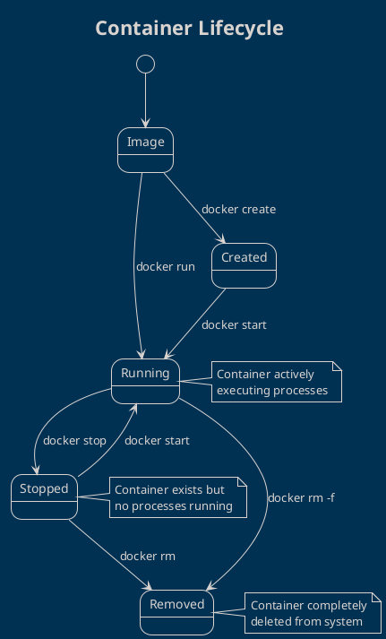

# Managing Docker Containers

Container management is a crucial skill for Docker developers. Let's master the essential commands to control, monitor, and troubleshoot containers effectively.

## Container Lifecycle Overview



## Essential Container Commands

### Listing Containers

```bash
# Show running containers
docker ps

# Show all containers (including stopped)
docker ps -a

# Show only container IDs
docker ps -q

# Show containers with custom format
docker ps --format "table {{.Names}}\t{{.Status}}\t{{.Ports}}"

# Show container sizes
docker ps -s
```

### Creating and Running Containers

```bash
# Create a container (but don't start it)
docker create --name my-nginx nginx:latest

# Run a container (create + start)
docker run -d --name web-server nginx:latest

# Run with port mapping
docker run -d -p 8080:80 --name web nginx:latest

# Run interactively
docker run -it ubuntu:latest bash

# Run with environment variables
docker run -d -e NODE_ENV=production -e PORT=3000 node-app

# Run with volume mount
docker run -d -v /host/path:/container/path nginx
```

### Starting and Stopping Containers

```bash
# Start a stopped container
docker start my-nginx

# Start multiple containers
docker start web-server app-server db-server

# Stop a running container (graceful shutdown)
docker stop my-nginx

# Stop with timeout (default 10 seconds)
docker stop -t 30 my-nginx

# Force stop container (immediate)
docker kill my-nginx

# Restart a container
docker restart my-nginx
```

### Container Information and Monitoring

```bash
# View detailed container information
docker inspect my-nginx

# Show container logs
docker logs my-nginx

# Follow logs in real-time
docker logs -f my-nginx

# Show recent logs with timestamps
docker logs -t --since="2h" my-nginx

# Show resource usage statistics
docker stats

# Show stats for specific containers
docker stats web-server db-server

# Show container processes
docker top my-nginx
```

### Executing Commands in Containers

```bash
# Execute command in running container
docker exec my-nginx ls -la /usr/share/nginx/html

# Interactive bash session
docker exec -it my-nginx bash

# Execute as different user
docker exec -u root -it my-nginx bash

# Execute command with environment variables
docker exec -e DEBUG=true my-nginx node debug.js
```

### Container File Operations

```bash
# Copy file from container to host
docker cp my-nginx:/usr/share/nginx/html/index.html ./index.html

# Copy file from host to container
docker cp ./custom.html my-nginx:/usr/share/nginx/html/

# Copy entire directory
docker cp ./website/. my-nginx:/usr/share/nginx/html/
```

## Advanced Container Management

### Container Health and Status

```bash
# Check container health status
docker ps --filter "health=healthy"
docker ps --filter "health=unhealthy"

# Show only running containers
docker ps --filter "status=running"

# Show containers created in last hour
docker ps --filter "since=1h"

# Show containers by name pattern
docker ps --filter "name=web*"
```

### Resource Management

```bash
# Run container with memory limit
docker run -d --memory="256m" nginx:latest

# Run with CPU limit (half a CPU core)  
docker run -d --cpus="0.5" nginx:latest

# Run with both CPU and memory limits
docker run -d --memory="512m" --cpus="1" nginx:latest

# Update resource limits for running container
docker update --memory="1g" --cpus="2" my-container
```

### Container Cleanup

```bash
# Remove a stopped container
docker rm my-nginx

# Remove multiple containers
docker rm web1 web2 web3

# Force remove running container
docker rm -f my-nginx

# Remove all stopped containers
docker container prune

# Remove containers older than 24 hours
docker container prune --filter "until=24h"
```

## Practical Container Management Scenarios

### Scenario 1: Web Server Management

```bash
# Deploy NGINX web server
docker run -d -p 80:80 --name production-web \
  --restart=unless-stopped \
  --memory="512m" \
  nginx:latest

# Monitor web server
docker logs -f production-web
docker stats production-web

# Update web content
docker cp ./new-website/. production-web:/usr/share/nginx/html/

# Restart web server
docker restart production-web
```

### Scenario 2: Database Container Management

```bash
# Run PostgreSQL database
docker run -d --name postgres-db \
  -e POSTGRES_DB=myapp \
  -e POSTGRES_USER=admin \
  -e POSTGRES_PASSWORD=secret123 \
  -v postgres-data:/var/lib/postgresql/data \
  -p 5432:5432 \
  postgres:15

# Connect to database
docker exec -it postgres-db psql -U admin -d myapp

# Backup database
docker exec postgres-db pg_dump -U admin myapp > backup.sql

# Monitor database performance
docker stats postgres-db
```

### Scenario 3: Development Environment

```bash
# Create development container with volume mount
docker run -it --name dev-env \
  -v $(pwd):/workspace \
  -w /workspace \
  -p 3000:3000 \
  node:18-alpine \
  sh

# Install dependencies inside container
docker exec -it dev-env npm install

# Run development server
docker exec -d dev-env npm start

# View application logs
docker logs -f dev-env
```

## Container Networking and Communication

```bash
# Create custom network
docker network create my-network

# Run containers on same network
docker run -d --network my-network --name web nginx:latest
docker run -d --network my-network --name api node:18-alpine

# Containers can communicate using names
# web container can reach api at http://api:3000

# Connect existing container to network
docker network connect my-network existing-container

# Disconnect container from network
docker network disconnect my-network container-name
```

## Container Troubleshooting

### Common Issues and Solutions

#### Container Won't Start
```bash
# Check container logs for errors
docker logs container-name

# Inspect container configuration
docker inspect container-name

# Check if port is already in use
netstat -tulpn | grep :8080
```

#### Container Consuming Too Much Resources
```bash
# Check resource usage
docker stats container-name

# Update resource limits
docker update --memory="256m" --cpus="0.5" container-name

# Restart with new limits
docker restart container-name
```

#### Can't Access Application
```bash
# Verify container is running
docker ps

# Check port mapping
docker port container-name

# Test from inside container
docker exec container-name curl http://localhost:8080

# Check network connectivity
docker exec container-name ping google.com
```

## Container Automation and Scripting

### Batch Operations
```bash
#!/bin/bash
# Stop all running containers
docker stop $(docker ps -q)

# Remove all stopped containers
docker container prune -f

# Remove all unused images
docker image prune -f

# Start specific services
containers=("web-server" "api-server" "database")
for container in "${containers[@]}"; do
    echo "Starting $container..."
    docker start "$container"
done
```

### Health Check Script
```bash
#!/bin/bash
# Check container health
check_container() {
    if docker ps | grep -q "$1"; then
        echo " $1 is running"
    else
        echo " $1 is not running"
        echo "Starting $1..."
        docker start "$1"
    fi
}

check_container "web-server"
check_container "database"
check_container "cache"
```

## Best Practices for Container Management

### Naming and Organization
- Use descriptive container names
- Follow consistent naming conventions
- Group related containers with prefixes
- Use labels for better organization

### Resource Management
- Set appropriate memory and CPU limits
- Monitor resource usage regularly
- Use restart policies for production containers
- Clean up unused containers regularly

### Security
- Run containers as non-root users when possible
- Limit container capabilities
- Use read-only filesystems when appropriate
- Regularly update base images

### Monitoring and Logging
- Centralize log collection
- Set up health checks for critical services
- Monitor resource consumption
- Implement alerting for container failures

## Next Steps

Now that you understand container management, let's explore persistent data storage with Docker volumes in the next lesson!

Key takeaways:
- Container lifecycle management is essential for production deployments
- Monitoring and resource management prevent performance issues
- Proper cleanup maintains system health
- Automation scripts improve operational efficiency

---
## References
- [Docker Container Commands](https://docs.docker.com/engine/reference/commandline/container/)
- [Container Resource Management](https://docs.docker.com/config/containers/resource_constraints/)
