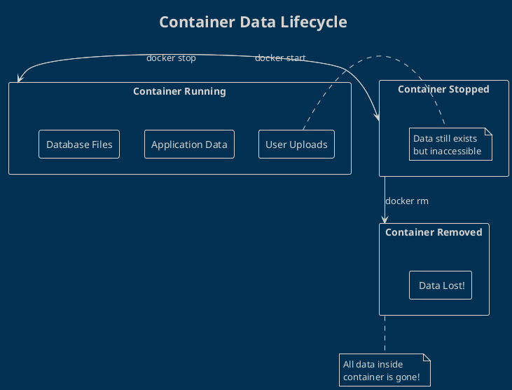
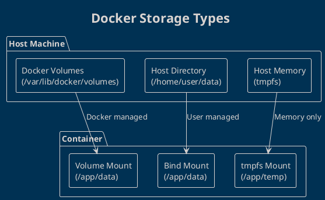

# Persistent Data with Docker Volumes

By default, container data is **ephemeral** - it disappears when the container is removed. Docker volumes solve this problem by providing persistent storage that survives container lifecycle changes.

## The Container Data Problem



**Problem scenarios:**
- Database container removed → All data lost
- Web app container updated → User uploads gone
- Container crashes → Log files disappear

## What are Docker Volumes?

**Docker volumes** are the preferred way to persist data generated and used by Docker containers. They're completely managed by Docker and exist independently of containers.

### Volume vs Bind Mount vs tmpfs



| Storage Type | Managed By | Performance | Use Case |
|-------------|------------|-------------|----------|
| **Volume** | Docker | Best | Production databases, app data |
| **Bind Mount** | User | Good | Development, config files |
| **tmpfs** | Docker | Fastest | Temporary files, caches |

## Working with Docker Volumes

### Creating and Managing Volumes

```bash
# Create a named volume
docker volume create my-data

# List all volumes
docker volume ls

# Inspect volume details
docker volume inspect my-data

# Remove unused volumes
docker volume prune

# Remove specific volume (only if not in use)
docker volume rm my-data
```

### Volume Information
```bash
# Detailed volume information
docker volume inspect my-data
```

**Output example:**
```json
[
    {
        "CreatedAt": "2026-02-14T10:30:45Z",
        "Driver": "local",
        "Labels": {},
        "Mountpoint": "/var/lib/docker/volumes/my-data/_data",
        "Name": "my-data",
        "Options": {},
        "Scope": "local"
    }
]
```

## Using Volumes with Containers

### Named Volumes

```bash
# Create and use named volume
docker volume create postgres-data

# Run PostgreSQL with named volume
docker run -d --name postgres-db \
  -e POSTGRES_PASSWORD=secret123 \
  -v postgres-data:/var/lib/postgresql/data \
  postgres:15

# Data persists even if container is removed
docker rm -f postgres-db
docker run -d --name postgres-new \
  -e POSTGRES_PASSWORD=secret123 \
  -v postgres-data:/var/lib/postgresql/data \
  postgres:15
# Database data is still there!
```

### Anonymous Volumes

```bash
# Docker creates anonymous volume automatically
docker run -d -v /var/lib/mysql mysql:8.0

# Anonymous volumes are harder to manage
# Better to use named volumes in production
```

### Bind Mounts

```bash
# Mount host directory into container
docker run -d --name web-server \
  -v /home/user/website:/usr/share/nginx/html:ro \
  -p 8080:80 \
  nginx:latest

# :ro makes it read-only
# :rw makes it read-write (default)
```

## Practical Volume Examples

### Example 1: Persistent Database

```bash
# Create volume for PostgreSQL data
docker volume create postgres-data

# Run PostgreSQL with persistent storage
docker run -d --name postgres \
  -e POSTGRES_DB=myapp \
  -e POSTGRES_USER=admin \
  -e POSTGRES_PASSWORD=secret123 \
  -v postgres-data:/var/lib/postgresql/data \
  -p 5432:5432 \
  postgres:15

# Connect and create some data
docker exec -it postgres psql -U admin -d myapp
# CREATE TABLE users (id SERIAL, name VARCHAR(50));
# INSERT INTO users (name) VALUES ('John'), ('Jane');

# Remove container
docker rm -f postgres

# Run new container with same volume
docker run -d --name postgres-new \
  -e POSTGRES_DB=myapp \
  -e POSTGRES_USER=admin \
  -e POSTGRES_PASSWORD=secret123 \
  -v postgres-data:/var/lib/postgresql/data \
  -p 5432:5432 \
  postgres:15

# Data is still there!
docker exec -it postgres-new psql -U admin -d myapp -c "SELECT * FROM users;"
```

### Example 2: Web Application with File Uploads

```bash
# Create volume for uploaded files
docker volume create webapp-uploads

# Run web application
docker run -d --name webapp \
  -v webapp-uploads:/app/uploads \
  -p 3000:3000 \
  my-web-app:latest

# Files uploaded to /app/uploads persist across container restarts
```

### Example 3: Development Environment

```bash
# Mount source code for live development
docker run -it --name dev-env \
  -v $(pwd):/workspace \
  -w /workspace \
  -p 3000:3000 \
  node:18-alpine \
  sh

# Changes to code on host immediately visible in container
# Perfect for development workflow
```

## Volume Sharing Between Containers

### Shared Data Volume

```bash
# Create shared volume
docker volume create shared-data

# Container 1: Producer
docker run -d --name producer \
  -v shared-data:/data \
  alpine sh -c "while true; do echo $(date) >> /data/log.txt; sleep 5; done"

# Container 2: Consumer  
docker run -d --name consumer \
  -v shared-data:/data \
  alpine sh -c "while true; do tail -f /data/log.txt; sleep 1; done"

# View consumer logs
docker logs -f consumer
```

### Volumes-from Pattern (Legacy)

```bash
# Data container (legacy approach)
docker create --name data-container -v /data alpine

# Use data from data-container
docker run -d --name app1 --volumes-from data-container nginx
docker run -d --name app2 --volumes-from data-container nginx

# Both containers share same data volume
```

## Advanced Volume Operations

### Volume Backup and Restore

```bash
# Backup volume data
docker run --rm -v postgres-data:/data -v $(pwd):/backup alpine \
  tar czf /backup/postgres-backup.tar.gz -C /data .

# Restore volume data
docker volume create postgres-restored
docker run --rm -v postgres-restored:/data -v $(pwd):/backup alpine \
  tar xzf /backup/postgres-backup.tar.gz -C /data
```

### Volume Migration

```bash
# Copy data from one volume to another
docker run --rm -v source-volume:/from -v target-volume:/to alpine \
  sh -c "cp -av /from/* /to/"
```

### Volume Driver Options

```bash
# Create volume with specific options
docker volume create --driver local \
  --opt type=nfs \
  --opt o=addr=192.168.1.100,rw \
  --opt device=:/path/to/dir \
  nfs-volume
```

## Volume Performance Optimization

### Best Practices for Performance

```bash
# Use volume mount for databases (better performance)
docker run -d --name fast-db \
  -v db-data:/var/lib/postgresql/data \
  postgres:15

# Use bind mount for development (easier access)
docker run -d --name dev-app \
  -v $(pwd)/src:/app/src \
  my-app:dev
```

### Volume Performance Comparison

| Scenario | Volume | Bind Mount | tmpfs |
|----------|---------|------------|-------|
| **Database** |  Best |  Good |  Data lost |
| **Development** |  Good |  Best |  Data lost |
| **Temporary files** |  OK |  OK |  Fastest |
| **Production** |  Best |  Risky |  Data lost |

## Common Volume Patterns

### Database with Backup Job

```bash
# Database container
docker run -d --name postgres \
  -v postgres-data:/var/lib/postgresql/data \
  -e POSTGRES_PASSWORD=secret \
  postgres:15

# Backup job container (runs periodically)
docker run --rm \
  -v postgres-data:/data:ro \
  -v $(pwd)/backups:/backups \
  alpine sh -c "tar czf /backups/db-$(date +%Y%m%d).tar.gz -C /data ."
```

### Multi-Container Application

```bash
# Shared volume for web app and worker
docker volume create app-data

# Web application
docker run -d --name web \
  -v app-data:/app/data \
  -p 8080:80 \
  my-web-app

# Background worker
docker run -d --name worker \
  -v app-data:/app/data \
  my-worker-app

# Both containers can read/write shared data
```

## Troubleshooting Volume Issues

### Volume Not Mounting
```bash
# Check if volume exists
docker volume ls | grep my-volume

# Check volume mount points
docker inspect container-name | grep -A 10 "Mounts"

# Verify permissions
docker exec container-name ls -la /mount/path
```

### Data Not Persisting
```bash
# Verify volume is mounted correctly
docker inspect container-name | jq '.[0].Mounts'

# Check if data is written to correct path
docker exec container-name df -h
```

### Permission Problems
```bash
# Fix ownership inside container
docker exec container-name chown -R app:app /data

# Run container with specific user
docker run --user $(id -u):$(id -g) -v data:/app my-app
```

## Volume Security Best Practices

### Access Control
```bash
# Read-only volumes for static content
docker run -v config-data:/etc/config:ro nginx

# Specific user ownership
docker run --user 1001:1001 -v user-data:/data my-app
```

### Volume Encryption
```bash
# Use encrypted storage driver (requires setup)
docker volume create --driver encrypted-driver secure-data
```

## Next Steps

With persistent data mastered, let's explore Docker networking to connect containers in the next lesson!

Key takeaways:
- Volumes provide persistent storage independent of container lifecycle
- Named volumes are preferred for production workloads
- Bind mounts are useful for development environments  
- Proper backup and restore strategies are essential for data safety

---
## References
- [Docker Volumes Documentation](https://docs.docker.com/storage/volumes/)
- [Storage Best Practices](https://docs.docker.com/storage/storagedriver/)
