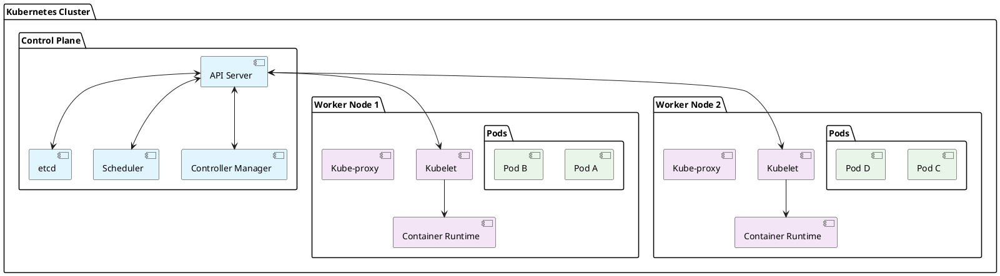

# Introduction to Kubernetes

Ready to take your containerization skills to the next level? **Kubernetes** is the industry-standard platform for container orchestration that powers applications at companies like Google, Netflix, and Airbnb.

## What is Kubernetes?

**Kubernetes** (also called K8s) is an open-source container orchestration platform that automates the deployment, scaling, and management of containerized applications across clusters of machines.

Think of it as an **intelligent traffic controller** for your containers, ensuring they run smoothly, recover from failures, and scale based on demand.

## Why Do You Need Kubernetes?

### The Container Challenge
While Docker solved application packaging, managing hundreds or thousands of containers across multiple servers creates new challenges:

- **Manual Management**: Manually starting/stopping containers becomes impossible at scale
- **Health Monitoring**: Who watches when containers fail and restarts them?
- **Load Distribution**: How do you distribute traffic across multiple container instances?
- **Scaling**: How do you automatically add more containers during high traffic?
- **Configuration Management**: How do you securely manage secrets and configurations?

### The Kubernetes Solution
Kubernetes addresses these challenges with:

- **Automated Deployment**: Deploy applications across multiple nodes automatically
- **Self-Healing**: Automatically restarts failed containers and replaces unhealthy nodes
- **Horizontal Scaling**: Automatically scale applications up/down based on CPU, memory, or custom metrics
- **Service Discovery**: Built-in load balancing and service discovery
- **Rolling Updates**: Deploy new versions with zero downtime
- **Configuration Management**: Secure handling of secrets, configs, and environment variables

## Kubernetes Architecture

### Control Plane Components

The **Control Plane** is the brain of Kubernetes that makes global decisions about the cluster:

| Component | Purpose | Real-World Analogy |
|-----------|---------|-------------------|
| **API Server** | Central communication hub for all cluster operations | Air traffic control tower |
| **etcd** | Distributed database storing all cluster state and configuration | Flight record database |
| **Scheduler** | Decides which worker node should run each new pod | Gate assignment coordinator |
| **Controller Manager** | Runs controllers that handle routine tasks (replication, endpoints, etc.) | Airport maintenance crew |

### Worker Node Components

**Worker Nodes** are the machines that run your application containers:

| Component | Purpose | Real-World Analogy |
|-----------|---------|-------------------|
| **Kubelet** | Agent that communicates with control plane and manages pods | Ground crew chief |
| **Kube-proxy** | Network proxy that handles load balancing for services | Baggage routing system |
| **Container Runtime** | Software that runs containers (Docker, containerd, etc.) | Aircraft engines |
| **Pods** | Smallest deployable units that contain one or more containers | Individual flights |

## Key Kubernetes Concepts

### **Pod**
- Smallest deployable unit in Kubernetes
- Contains one or more tightly coupled containers
- Shares network and storage within the pod
- Usually contains just one main application container

### **Deployment** 
- Manages multiple replicas of pods
- Handles rolling updates and rollbacks
- Ensures desired number of pods are always running

### **Service**
- Provides stable network access to pods
- Load balances traffic across multiple pods
- Remains constant even as pods come and go

### **ConfigMap & Secret**
- **ConfigMap**: Stores non-sensitive configuration data
- **Secret**: Stores sensitive data like passwords, tokens, keys

## Kubernetes vs Docker Swarm vs Traditional Deployment

| Feature | Traditional VMs | Docker Swarm | Kubernetes |
|---------|---------------|--------------|------------|
| **Complexity** | Low | Medium | High |
| **Scalability** | Manual | Good | Excellent |
| **Self-healing** | None | Basic | Advanced |
| **Ecosystem** | Limited | Docker-focused | Vast |
| **Learning Curve** | Gentle | Moderate | Steep |
| **Enterprise Features** | Basic | Good | Comprehensive |

## Real-World Use Cases

### **Web Applications**
- **Netflix**: Runs microservices at massive scale
- **Spotify**: Manages music streaming infrastructure
- **Airbnb**: Handles booking and payment systems

### **Data Processing**
- **Pinterest**: Processes billions of user interactions
- **Bloomberg**: Real-time financial data processing

### **Enterprise Applications**
- **JPMorgan Chase**: Banking applications and services
- **Walmart**: E-commerce and inventory management

## What You'll Learn in This Series

By the end of this Kubernetes course, you'll be able to:

1. **Install and configure** Kubernetes clusters
2. **Deploy applications** using pods, deployments, and services
3. **Manage networking** and service discovery
4. **Handle persistent storage** with volumes
5. **Configure applications** with ConfigMaps and Secrets
6. **Implement scaling** and rolling updates
7. **Apply best practices** for production deployments

## Prerequisites

Before diving into Kubernetes, make sure you're comfortable with:
- **Docker basics** - containers, images, Dockerfile
- **Linux command line** - basic navigation and file operations
- **YAML syntax** - Kubernetes uses YAML for configuration
- **Networking concepts** - ports, DNS, load balancing

## Next Steps

Ready to get your hands dirty? In the next article, we'll install Kubernetes and set up your first cluster. You'll learn about different installation options and get everything configured for the hands-on exercises ahead.

---

*Pro Tip: Kubernetes has a steep learning curve, but don't get overwhelmed! Start with the basics and gradually build up your knowledge. Every expert was once a beginner.*
