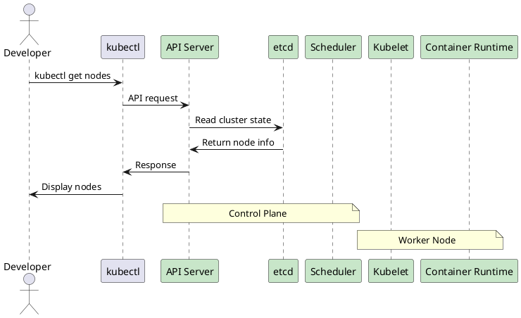

# Installing Kubernetes

Now that you understand what Kubernetes is, let's get it running! There are several ways to install Kubernetes, each suitable for different use cases. We'll cover the most popular options and help you choose the right one.

## Installation Options Overview

| Method | Best For | Difficulty | Resource Usage |
|--------|----------|------------|----------------|
| **Minikube** | Learning & Development | Easy | Low (1-2 GB RAM) |
| **Docker Desktop** | Local Development | Easy | Medium (4 GB RAM) |
| **kubeadm** | Production Clusters | Medium | High (8+ GB RAM) |
| **Managed Services** | Production (Cloud) | Easy | Variable |

## Option 1: Minikube (Recommended for Beginners) 🌟

**Minikube** creates a single-node Kubernetes cluster on your local machine - perfect for learning!

### Prerequisites
- 2+ CPUs
- 2GB+ RAM
- 20GB+ disk space
- Container runtime (Docker, Podman, etc.)

### Install Docker First

```bash
# Ubuntu/Debian
sudo apt update
sudo apt install docker.io -y
sudo systemctl enable docker
sudo systemctl start docker
sudo usermod -aG docker $USER

# macOS (with Homebrew)
brew install docker

# Windows: Download Docker Desktop from docker.com
```

### Install Minikube

```bash
# Linux
curl -LO https://storage.googleapis.com/minikube/releases/latest/minikube-linux-amd64
sudo install minikube-linux-amd64 /usr/local/bin/minikube

# macOS
brew install minikube

# Windows (PowerShell as Administrator)
winget install minikube
```

### Install kubectl

```bash
# Linux
curl -LO "https://dl.k8s.io/release/$(curl -L -s https://dl.k8s.io/release/stable.txt)/bin/linux/amd64/kubectl"
chmod +x kubectl
sudo mv kubectl /usr/local/bin/

# macOS
brew install kubectl

# Windows
winget install kubectl
```

### Start Your Cluster

```bash
# Start minikube
minikube start

# Verify installation
kubectl get nodes
kubectl cluster-info

# Check minikube status
minikube status
```

**Expected Output:**
```
 minikube v1.32.0 on Ubuntu 20.04
 Using the docker driver based on existing profile
👍 Starting control plane node minikube in cluster minikube
🚜 Pulling base image ...
 Restarting existing docker container for "minikube" ...
🐳 Preparing Kubernetes v1.28.3 on Docker 24.0.7 ...
 Configuring bridge CNI (Container Networking Interface) ...
🔎 Verifying Kubernetes components...
🌟 Enabled addons: default-storageclass, storage-provisioner
🏄 Done! kubectl is now configured to use "minikube" cluster.
```

## Option 2: Docker Desktop (GUI-Friendly) 

If you prefer a graphical interface, Docker Desktop includes Kubernetes:

### Steps
1. **Install Docker Desktop** from [docker.com](https://docker.com)
2. **Enable Kubernetes**: Settings → Kubernetes → "Enable Kubernetes"
3. **Apply & Restart**: Wait for installation to complete
4. **Verify**: Open terminal and run `kubectl get nodes`

## Option 3: kubeadm (Production-Ready) 🏭

For production clusters or learning advanced concepts, use kubeadm:

### Prerequisites
- Multiple Linux machines (VMs or physical)
- 2+ CPUs per machine
- 2GB+ RAM per machine
- Network connectivity between machines

### Install Prerequisites on All Nodes

```bash
# Update system
sudo apt update

# Install Docker
sudo apt install docker.io -y
sudo systemctl enable docker
sudo systemctl start docker

# Disable swap (required by Kubernetes)
sudo swapoff -a
sudo sed -i '/ swap / s/^\(.*\)$/#\1/g' /etc/fstab

# Install kubeadm, kubelet, kubectl
sudo apt update
sudo apt install -y apt-transport-https ca-certificates curl

curl -fsSL https://packages.cloud.google.com/apt/doc/apt-key.gpg | sudo apt-key add -
sudo apt-add-repository "deb http://apt.kubernetes.io/ kubernetes-xenial main"

sudo apt update
sudo apt install -y kubelet kubeadm kubectl
sudo apt-mark hold kubelet kubeadm kubectl
```

### Initialize Control Plane (Master Node)

```bash
# Initialize cluster
sudo kubeadm init --pod-network-cidr=192.168.0.0/16

# Set up kubeconfig
mkdir -p $HOME/.kube
sudo cp -i /etc/kubernetes/admin.conf $HOME/.kube/config
sudo chown $(id -u):$(id -g) $HOME/.kube/config

# Install network plugin (Calico)
kubectl apply -f https://raw.githubusercontent.com/projectcalico/calico/v3.25.0/manifests/calico.yaml
```

### Join Worker Nodes

After initializing the control plane, you'll see a join command like:

```bash
# Run this on each worker node
sudo kubeadm join 192.168.1.100:6443 --token abc123.xyz789 \
 --discovery-token-ca-cert-hash sha256:hash_value_here
```

## Option 4: Managed Kubernetes Services 

For production workloads, consider managed services:

### Popular Options
- **AWS EKS**: Amazon Elastic Kubernetes Service
- **Google GKE**: Google Kubernetes Engine 
- **Azure AKS**: Azure Kubernetes Service
- **DigitalOcean DOKS**: DigitalOcean Kubernetes

### Example: Creating GKE Cluster

```bash
# Install gcloud CLI
curl https://sdk.cloud.google.com | bash

# Authenticate
gcloud auth login

# Create cluster
gcloud container clusters create my-cluster \
 --zone=us-central1-a \
 --num-nodes=3

# Get credentials
gcloud container clusters get-credentials my-cluster --zone=us-central1-a
```

## Verification Steps 🔍

Regardless of which method you chose, verify your installation:

### Basic Verification

```bash
# Check cluster info
kubectl cluster-info

# List nodes
kubectl get nodes

# Check system pods
kubectl get pods --all-namespaces

# Verify kubectl version
kubectl version --client --server
```

### Deploy Test Application

```bash
# Create a test deployment
kubectl create deployment hello-k8s --image=nginx

# Expose the deployment
kubectl expose deployment hello-k8s --port=80 --type=NodePort

# Check the service
kubectl get services

# Access the application (for minikube)
minikube service hello-k8s --url
```

### Architecture Verification



## Useful kubectl Commands for Verification

```bash
# Get detailed node information
kubectl describe nodes

# Check cluster health
kubectl get componentstatuses

# Monitor cluster events
kubectl get events --sort-by='.lastTimestamp'

# Check available API resources
kubectl api-resources

# Get cluster configuration
kubectl config view
```

## Common Installation Issues & Solutions 

### Issue: Minikube Won't Start
```bash
# Solution: Check Docker and restart minikube
minikube delete
minikube start --driver=docker
```

### Issue: kubectl Command Not Found
```bash
# Solution: Add kubectl to PATH or install it
echo 'export PATH=$PATH:/usr/local/bin' >> ~/.bashrc
source ~/.bashrc
```

### Issue: Network Connectivity Problems
```bash
# Solution: Check firewall and reset network
sudo ufw allow 6443/tcp
minikube delete && minikube start
```

### Issue: Insufficient Resources
```bash
# Solution: Allocate more resources to minikube
minikube start --memory=4096 --cpus=2
```

## Post-Installation Setup 

### Enable Helpful Addons (Minikube)

```bash
# Enable ingress for advanced networking
minikube addons enable ingress

# Enable metrics server for resource monitoring 
minikube addons enable metrics-server

# Enable dashboard for web UI
minikube addons enable dashboard
minikube dashboard
```

### Configure kubectl Auto-completion

```bash
# For Bash
echo 'source <(kubectl completion bash)' >> ~/.bashrc

# For Zsh
echo 'source <(kubectl completion zsh)' >> ~/.zshrc

# For Fish
kubectl completion fish | source
```

### Set up Aliases (Optional but Helpful)

```bash
# Add to ~/.bashrc or ~/.zshrc
alias k=kubectl
alias kgp='kubectl get pods'
alias kgs='kubectl get services'
alias kgd='kubectl get deployments'
```

## What's Next? 

Congratulations! You now have a working Kubernetes cluster. In the next article, we'll explore **Pods and Deployments** - the fundamental building blocks of Kubernetes applications.

You'll learn how to:
- Create and manage pods
- Use deployments for scalable applications
- Understand the relationship between pods and containers
- Monitor and troubleshoot your applications

## Quick Reference 

### Essential Commands to Remember
```bash
minikube start # Start local cluster
kubectl get nodes # List cluster nodes
kubectl get pods # List running pods
kubectl cluster-info # Show cluster information
minikube stop # Stop local cluster
```

---

* **Pro Tip**: Keep your cluster running as you go through this course. Starting and stopping repeatedly can be time-consuming. If you need to free up resources, use `minikube pause` and `minikube unpause` instead.*
