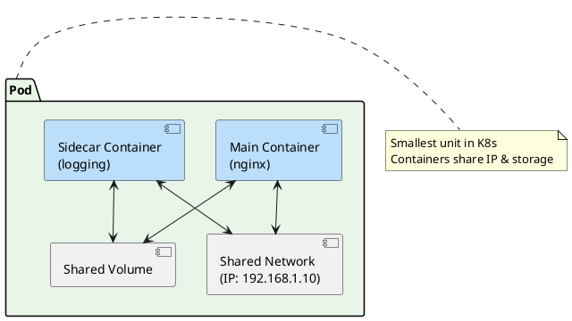
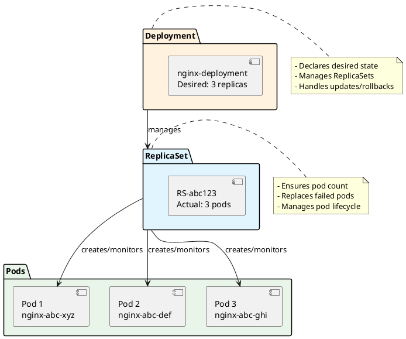

# Pods and Deployments

Now that you have Kubernetes running, let's dive into the core concepts: **Pods** and **Deployments**. These are the fundamental building blocks that make Kubernetes so powerful for managing containerized applications.

## Understanding Pods 

A **Pod** is the smallest deployable unit in Kubernetes. Think of it as a "house" for your containers.

### Key Pod Concepts

- **Single Responsibility**: Usually contains one main application container
- **Shared Network**: All containers in a pod share the same IP address and ports
- **Shared Storage**: Containers can share volumes for data exchange 
- **Lifecycle**: Containers in a pod are created, started, and stopped together
- **Ephemeral**: Pods are temporary - they come and go

### Pod Architecture



## Creating Your First Pod 

### Simple Pod Example

Create a file called `nginx-pod.yaml`:

```yaml
apiVersion: v1
kind: Pod
metadata:
 name: nginx-pod
 labels:
 app: nginx
 environment: development
spec:
 containers:
 - name: nginx
 image: nginx:1.21
 ports:
 - containerPort: 80
 name: http
 resources:
 requests:
 memory: "64Mi"
 cpu: "100m"
 limits:
 memory: "128Mi"
 cpu: "200m"
```

### Deploy and Examine the Pod

```bash
# Create the pod
kubectl apply -f nginx-pod.yaml

# Verify pod is running
kubectl get pods

# Get detailed information
kubectl describe pod nginx-pod

# Check pod logs
kubectl logs nginx-pod

# Execute commands inside the pod
kubectl exec -it nginx-pod -- /bin/bash
```

**Expected Output:**
```
NAME READY STATUS RESTARTS AGE
nginx-pod 1/1 Running 0 30s
```

### Multi-Container Pod Example

```yaml
apiVersion: v1
kind: Pod
metadata:
 name: multi-container-pod
spec:
 containers:
 - name: nginx
 image: nginx:1.21
 ports:
 - containerPort: 80
 volumeMounts:
 - name: shared-data
 mountPath: /usr/share/nginx/html
 
 - name: content-generator
 image: busybox
 command: ["/bin/sh"]
 args: ["-c", "while true; do echo '<h1>Hello from Pod!</h1><p>Time: $(date)</p>' > /data/index.html; sleep 30; done"]
 volumeMounts:
 - name: shared-data
 mountPath: /data
 
 volumes:
 - name: shared-data
 emptyDir: {}
```

## Understanding Deployments 

**Deployments** solve the limitations of bare pods by providing:

- **Replication**: Run multiple pod copies
- **Self-healing**: Automatically replace failed pods
- **Rolling updates**: Update apps with zero downtime
- **Rollbacks**: Easily revert to previous versions
- **Scaling**: Adjust number of replicas

### Deployment Architecture



## Creating Your First Deployment 

### Basic Deployment

Create `nginx-deployment.yaml`:

```yaml
apiVersion: apps/v1
kind: Deployment
metadata:
 name: nginx-deployment
 labels:
 app: nginx
spec:
 replicas: 3
 selector:
 matchLabels:
 app: nginx
 template:
 metadata:
 labels:
 app: nginx
 spec:
 containers:
 - name: nginx
 image: nginx:1.21
 ports:
 - containerPort: 80
 resources:
 requests:
 memory: "64Mi"
 cpu: "100m"
 limits:
 memory: "128Mi"
 cpu: "200m"
 livenessProbe:
 httpGet:
 path: /
 port: 80
 initialDelaySeconds: 30
 periodSeconds: 10
 readinessProbe:
 httpGet:
 path: /
 port: 80
 initialDelaySeconds: 5
 periodSeconds: 5
```

### Deploy and Manage

```bash
# Create deployment
kubectl apply -f nginx-deployment.yaml

# Check deployment status
kubectl get deployments

# View replica sets
kubectl get replicasets

# List all pods created by deployment
kubectl get pods -l app=nginx

# Watch pods in real-time
kubectl get pods -l app=nginx -w
```

### Scaling Operations

```bash
# Scale up to 5 replicas
kubectl scale deployment nginx-deployment --replicas=5

# Scale down to 2 replicas 
kubectl scale deployment nginx-deployment --replicas=2

# Check scaling progress
kubectl rollout status deployment nginx-deployment

# Auto-scale based on CPU usage (requires metrics server)
kubectl autoscale deployment nginx-deployment --cpu-percent=50 --min=2 --max=10
```

## Advanced Deployment Strategies 

### Rolling Updates

```bash
# Update to newer nginx version
kubectl set image deployment nginx-deployment nginx=nginx:1.22

# Monitor update progress
kubectl rollout status deployment nginx-deployment

# View rollout history
kubectl rollout history deployment nginx-deployment

# Rollback to previous version
kubectl rollout undo deployment nginx-deployment

# Rollback to specific revision
kubectl rollout undo deployment nginx-deployment --to-revision=1
```

### Update Strategy Configuration

```yaml
apiVersion: apps/v1
kind: Deployment
metadata:
 name: nginx-deployment
spec:
 replicas: 6
 strategy:
 type: RollingUpdate
 rollingUpdate:
 maxSurge: 2 # Max extra pods during update
 maxUnavailable: 1 # Max unavailable pods during update
 # ... rest of spec
```

### Blue-Green Deployment Example

```yaml
# Green version (current)
apiVersion: apps/v1
kind: Deployment
metadata:
 name: nginx-green
spec:
 replicas: 3
 selector:
 matchLabels:
 app: nginx
 version: green
 template:
 metadata:
 labels:
 app: nginx
 version: green
 spec:
 containers:
 - name: nginx
 image: nginx:1.21
 ports:
 - containerPort: 80
---
# Blue version (new)
apiVersion: apps/v1
kind: Deployment
metadata:
 name: nginx-blue
spec:
 replicas: 3
 selector:
 matchLabels:
 app: nginx
 version: blue
 template:
 metadata:
 labels:
 app: nginx
 version: blue
 spec:
 containers:
 - name: nginx
 image: nginx:1.22
 ports:
 - containerPort: 80
```

## Practical Exercises 

### Exercise 1: Debug a Failed Pod

```bash
# Create a pod with wrong image
kubectl run broken-pod --image=nginx:nonexistent

# Diagnose the issue
kubectl get pods
kubectl describe pod broken-pod
kubectl logs broken-pod

# Fix the issue
kubectl delete pod broken-pod
kubectl run fixed-pod --image=nginx:1.21
```

### Exercise 2: Deployment Health Check

```bash
# Create deployment with health checks
kubectl apply -f nginx-deployment.yaml

# Simulate a container crash
kubectl exec -it $(kubectl get pods -l app=nginx -o name | head -1) -- pkill nginx

# Watch Kubernetes recover the pod
kubectl get pods -l app=nginx -w
```

### Exercise 3: Resource Management

```yaml
apiVersion: apps/v1
kind: Deployment
metadata:
 name: resource-demo
spec:
 replicas: 2
 selector:
 matchLabels:
 app: resource-demo
 template:
 metadata:
 labels:
 app: resource-demo
 spec:
 containers:
 - name: stress-test
 image: busybox
 command: ["sh", "-c", "while true; do echo 'Working...'; sleep 10; done"]
 resources:
 requests:
 memory: "100Mi"
 cpu: "100m"
 limits:
 memory: "200Mi"
 cpu: "200m"
```

## Common Commands Cheat Sheet 

### Pod Commands
```bash
# Create pod from YAML
kubectl apply -f pod.yaml

# Get pods
kubectl get pods
kubectl get pods -o wide
kubectl get pods --show-labels

# Describe pod
kubectl describe pod <pod-name>

# Delete pod
kubectl delete pod <pod-name>
kubectl delete -f pod.yaml
```

### Deployment Commands
```bash
# Create deployment
kubectl create deployment <name> --image=<image>
kubectl apply -f deployment.yaml

# Get deployments
kubectl get deployments
kubectl get deploy -o wide

# Scale deployment
kubectl scale deployment <name> --replicas=<count>

# Update deployment
kubectl set image deployment <name> <container>=<new-image>

# Rollback deployment
kubectl rollout undo deployment <name>

# Delete deployment
kubectl delete deployment <name>
```

## Troubleshooting Common Issues 

### Pod Stuck in Pending State
```bash
# Check resource constraints
kubectl describe pod <pod-name>
kubectl top nodes
kubectl get nodes -o wide

# Check events
kubectl get events --sort-by='.metadata.creationTimestamp'
```

### Pod Crash Loop
```bash
# Check logs
kubectl logs <pod-name> --previous

# Check pod events
kubectl describe pod <pod-name>

# Debug with different image
kubectl run debug-pod --image=busybox -it --rm
```

### Image Pull Errors
```bash
# Verify image exists
docker pull <image-name>

# Check imagePullSecrets
kubectl describe pod <pod-name>

# Check node connectivity
kubectl get nodes
```

## Key Takeaways 

 **Pods** are the smallest unit in Kubernetes - usually contain one container
 **Deployments** manage pods with replication, scaling, and updates
 **ReplicaSets** ensure desired number of pod replicas (managed by Deployments)
 **Rolling updates** allow zero-downtime deployments
 **Health checks** ensure containers are ready and healthy
 **Resource limits** prevent containers from consuming too many resources

## What's Next? 

Great job! You now understand how to deploy and manage applications with Pods and Deployments. In the next article, we'll explore **Services and Networking** - how to make your applications accessible and enable communication between different parts of your system.

You'll learn about:
- Service types (ClusterIP, NodePort, LoadBalancer)
- Service discovery and DNS
- Load balancing
- Network policies

---

* **Pro Tip**: Always use Deployments instead of bare Pods in production. Deployments provide self-healing, scaling, and update capabilities that bare Pods lack.*
