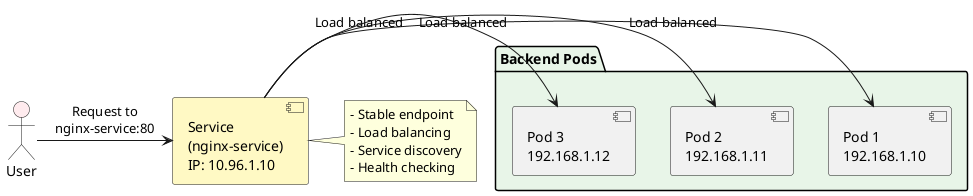
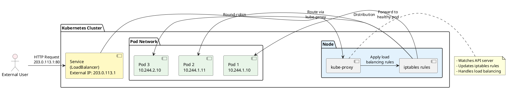

# Services and Networking

Your applications are running in pods, but how do you make them accessible? How do pods communicate with each other? Welcome to Kubernetes **Services** - the networking layer that makes everything connect seamlessly!

## The Networking Challenge

Imagine you have 3 nginx pods running your web application. Without services, you'd face these problems:

- **Dynamic IPs**: Pods get new IP addresses when they restart
- **No Load Balancing**: Traffic goes to random pods
- **Discovery Issues**: How do other pods find your application?
- **External Access**: How do users reach your app from outside the cluster?

**Services** solve all these problems!

## What is a Kubernetes Service? 

A **Service** is a stable network endpoint that:
- Provides a consistent IP address and DNS name
- Load balances traffic across multiple pods
- Automatically discovers healthy pods
- Enables communication between different parts of your application

### Service Architecture



## Service Types 

Kubernetes offers four main service types:

| Type | Use Case | Access Method | Real-World Example |
|------|----------|---------------|-------------------|
| **ClusterIP** | Internal only | Cluster DNS | Database, internal APIs |
| **NodePort** | External access | Node IP:Port | Development, testing |
| **LoadBalancer** | Production external | Cloud LB | Production web apps |
| **ExternalName** | External services | DNS CNAME | External databases |

## 1. ClusterIP Service (Internal Communication) 

**ClusterIP** is the default service type - only accessible within the cluster.

### Example: Database Service

```yaml
apiVersion: apps/v1
kind: Deployment
metadata:
 name: mysql-deployment
spec:
 replicas: 1
 selector:
 matchLabels:
 app: mysql
 template:
 metadata:
 labels:
 app: mysql
 spec:
 containers:
 - name: mysql
 image: mysql:8.0
 env:
 - name: MYSQL_ROOT_PASSWORD
 value: "password123"
 ports:
 - containerPort: 3306
---
apiVersion: v1
kind: Service
metadata:
 name: mysql-service
spec:
 type: ClusterIP # Default, can be omitted
 selector:
 app: mysql
 ports:
 - port: 3306
 targetPort: 3306
 name: mysql
```

### Test Internal Connectivity

```bash
# Apply the configuration
kubectl apply -f mysql-deployment.yaml

# Create a test pod to connect to MySQL
kubectl run mysql-client --image=mysql:8.0 -it --rm --restart=Never -- \
 mysql -h mysql-service -uroot -ppassword123

# Inside the pod, you can connect using the service name!
# mysql-service resolves to the service IP automatically
```

## 2. NodePort Service (External Access via Node) 

**NodePort** exposes your service on a specific port on every node.

### Example: Web Application

```yaml
apiVersion: apps/v1
kind: Deployment
metadata:
 name: web-deployment
spec:
 replicas: 3
 selector:
 matchLabels:
 app: web
 template:
 metadata:
 labels:
 app: web
 spec:
 containers:
 - name: nginx
 image: nginx:1.21
 ports:
 - containerPort: 80
---
apiVersion: v1
kind: Service
metadata:
 name: web-service
spec:
 type: NodePort
 selector:
 app: web
 ports:
 - port: 80 # Service port
 targetPort: 80 # Pod port
 nodePort: 30080 # External port (30000-32767)
 name: http
```

### Access the Application

```bash
# Apply the configuration
kubectl apply -f web-deployment.yaml

# Get service details
kubectl get services

# For minikube, get the URL
minikube service web-service --url

# For regular clusters, access via any node IP
# http://NODE_IP:30080
```

## 3. LoadBalancer Service (Cloud Provider) 

**LoadBalancer** creates an external load balancer (requires cloud provider).

```yaml
apiVersion: v1
kind: Service
metadata:
 name: web-loadbalancer
spec:
 type: LoadBalancer
 selector:
 app: web
 ports:
 - port: 80
 targetPort: 80
 name: http
```

### Monitor LoadBalancer Creation

```bash
# Apply the service
kubectl apply -f web-loadbalancer.yaml

# Watch for external IP assignment
kubectl get services -w

# Access via external IP (when available)
# http://EXTERNAL_IP/
```

## 4. ExternalName Service (DNS Alias) 

**ExternalName** creates a DNS alias to external services.

```yaml
apiVersion: v1
kind: Service
metadata:
 name: external-database
spec:
 type: ExternalName
 externalName: database.example.com
 ports:
 - port: 5432
```

## Service Discovery and DNS

Kubernetes provides automatic DNS resolution for services:

### DNS Patterns

| Service Location | DNS Name |
|------------------|----------|
| Same namespace | `service-name` |
| Different namespace | `service-name.namespace-name` |
| Fully qualified | `service-name.namespace-name.svc.cluster.local` |

### Example: Microservices Communication

```yaml
# Frontend service
apiVersion: v1
kind: Service
metadata:
 name: frontend
 namespace: web
spec:
 selector:
 app: frontend
 ports:
 - port: 80
 targetPort: 3000
---
# Backend service 
apiVersion: v1
kind: Service
metadata:
 name: backend
 namespace: api
spec:
 selector:
 app: backend
 ports:
 - port: 8080
 targetPort: 8080
```

### Connection Examples

```bash
# From frontend pod, connect to backend:
curl http://backend.api:8080/users

# From same namespace:
curl http://frontend:80

# Fully qualified:
curl http://backend.api.svc.cluster.local:8080
```

## Advanced Networking Concepts 

### Session Affinity

Ensure requests from the same client go to the same pod:

```yaml
apiVersion: v1
kind: Service
metadata:
 name: sticky-service
spec:
 selector:
 app: web
 ports:
 - port: 80
 targetPort: 80
 sessionAffinity: ClientIP
 sessionAffinityConfig:
 clientIP:
 timeoutSeconds: 3600
```

### Headless Services

Get individual pod IPs instead of load balancing:

```yaml
apiVersion: v1
kind: Service
metadata:
 name: headless-service
spec:
 clusterIP: None # Makes it headless
 selector:
 app: database
 ports:
 - port: 3306
 targetPort: 3306
```

### Service with Multiple Ports

```yaml
apiVersion: v1
kind: Service
metadata:
 name: multi-port-service
spec:
 selector:
 app: web
 ports:
 - name: http
 port: 80
 targetPort: 8080
 - name: https
 port: 443
 targetPort: 8443
 - name: metrics
 port: 9090
 targetPort: 9090
```

## Networking Flow Visualization



## Practical Examples 

### Example 1: Complete Web Application Stack

```yaml
# Database deployment and service
apiVersion: apps/v1
kind: Deployment
metadata:
 name: postgres
spec:
 replicas: 1
 selector:
 matchLabels:
 app: postgres
 template:
 metadata:
 labels:
 app: postgres
 spec:
 containers:
 - name: postgres
 image: postgres:13
 env:
 - name: POSTGRES_PASSWORD
 value: "password"
 ports:
 - containerPort: 5432
---
apiVersion: v1
kind: Service
metadata:
 name: postgres-service
spec:
 selector:
 app: postgres
 ports:
 - port: 5432
 targetPort: 5432
---
# Web application deployment and service
apiVersion: apps/v1 
kind: Deployment
metadata:
 name: webapp
spec:
 replicas: 3
 selector:
 matchLabels:
 app: webapp
 template:
 metadata:
 labels:
 app: webapp
 spec:
 containers:
 - name: webapp
 image: nginx:1.21
 ports:
 - containerPort: 80
 env:
 - name: DB_HOST
 value: "postgres-service"
 - name: DB_PORT
 value: "5432"
---
apiVersion: v1
kind: Service
metadata:
 name: webapp-service
spec:
 type: LoadBalancer
 selector:
 app: webapp
 ports:
 - port: 80
 targetPort: 80
```

### Example 2: Service Health Monitoring

```yaml
apiVersion: v1
kind: Service
metadata:
 name: healthy-service
spec:
 selector:
 app: webapp
 ports:
 - port: 80
 targetPort: 80
---
apiVersion: apps/v1
kind: Deployment
metadata:
 name: webapp
spec:
 replicas: 3
 selector:
 matchLabels:
 app: webapp
 template:
 metadata:
 labels:
 app: webapp
 spec:
 containers:
 - name: webapp
 image: nginx:1.21
 ports:
 - containerPort: 80
 readinessProbe:
 httpGet:
 path: /health
 port: 80
 initialDelaySeconds: 5
 periodSeconds: 10
 livenessProbe:
 httpGet:
 path: /health
 port: 80
 initialDelaySeconds: 30
 periodSeconds: 15
```

## Troubleshooting Services 

### Common Issues and Solutions

#### Service Not Accessible

```bash
# Check if service exists
kubectl get services

# Verify service endpoints
kubectl get endpoints

# Check pod labels match service selector
kubectl get pods --show-labels
kubectl describe service <service-name>
```

#### No External IP for LoadBalancer

```bash
# Check if running on cloud provider
kubectl get nodes -o wide

# For minikube, use tunnel
minikube tunnel

# Check cloud provider configuration
kubectl describe service <service-name>
```

#### DNS Resolution Issues

```bash
# Test DNS from pod
kubectl run test-pod --image=busybox -it --rm -- \
 nslookup <service-name>

# Check CoreDNS pods
kubectl get pods -n kube-system -l k8s-app=kube-dns

# View DNS configuration
kubectl get configmap coredns -n kube-system -o yaml
```

## Service Testing Commands 

```bash
# Create test deployment and service
kubectl create deployment test-app --image=nginx
kubectl expose deployment test-app --port=80 --target-port=80

# Test different service types
kubectl patch service test-app -p '{"spec":{"type":"NodePort"}}'
kubectl patch service test-app -p '{"spec":{"type":"LoadBalancer"}}'

# View service details
kubectl get services -o wide
kubectl describe service test-app

# Test connectivity from pod
kubectl run test-pod --image=busybox -it --rm -- \
 wget -qO- test-app:80

# Port forward for local testing
kubectl port-forward service/test-app 8080:80
# Then access http://localhost:8080
```

## Key Networking Commands 

```bash
# Service operations
kubectl get services
kubectl describe service <name>
kubectl delete service <name>

# Endpoint inspection
kubectl get endpoints
kubectl describe endpoints <name>

# Network debugging
kubectl run network-debug --image=busybox -it --rm
kubectl exec -it <pod> -- netstat -tulpn
kubectl logs -n kube-system -l component=kube-proxy

# Port forwarding
kubectl port-forward pod/<pod-name> <local-port>:<pod-port>
kubectl port-forward service/<service-name> <local-port>:<service-port>
```

## Key Takeaways 

 **Services** provide stable network endpoints for dynamic pods
 **ClusterIP** for internal communication, **NodePort** for external access
 **LoadBalancer** for production external access (cloud required)
 **DNS service discovery** enables easy pod-to-pod communication
 **Label selectors** connect services to the right pods
 **Health checks** ensure traffic only goes to ready pods

## What's Next? 

Excellent! You now understand how to connect and expose your applications in Kubernetes. In the next article, we'll dive into **ConfigMaps and Secrets** - how to manage configuration data and sensitive information securely.

You'll learn how to:
- Store configuration separately from code
- Manage environment-specific settings
- Handle passwords, tokens, and certificates securely
- Update configurations without rebuilding containers

---

* **Pro Tip**: Always use services instead of direct pod IPs. Pods are ephemeral, but services provide stable endpoints that survive pod restarts and scaling operations.*
