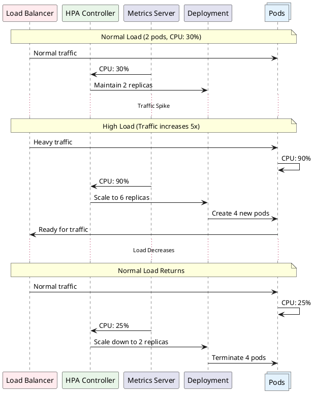
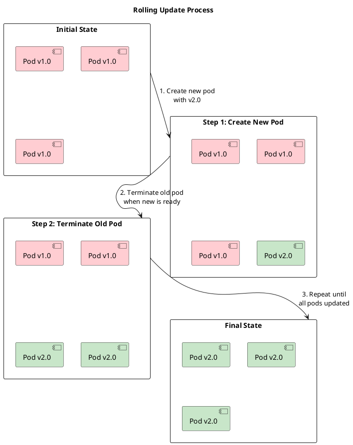

# Scaling and Rolling Updates

Your application is live, users are happy, but suddenly traffic spikes 10x during a sale event! Or maybe you need to deploy a critical bug fix without taking the service offline. This is where Kubernetes truly shines with its **scaling** and **rolling update** capabilities.

## The Scaling Challenge 📈

### Traditional Scaling Problems
- **Manual intervention** needed during traffic spikes
- **Downtime** required for updates and deployments
- **Over-provisioning** resources to handle peak loads
- **Slow response** to changing demand
- **Risk** of breaking production during updates

### The Kubernetes Solution 
- **Horizontal Pod Autoscaling** based on metrics
- **Rolling updates** with zero downtime
- **Resource-based scaling** decisions
- **Instant response** to load changes
- **Rollback capabilities** for failed deployments

## Horizontal Pod Autoscaling (HPA) 

**HPA** automatically scales the number of pods based on observed CPU utilization, memory usage, or custom metrics.

### Basic HPA Setup

```yaml
# First, deploy an application
apiVersion: apps/v1
kind: Deployment
metadata:
 name: webapp
spec:
 replicas: 3
 selector:
 matchLabels:
 app: webapp
 template:
 metadata:
 labels:
 app: webapp
 spec:
 containers:
 - name: webapp
 image: nginx:1.21
 resources:
 requests:
 cpu: 100m # Request 100 millicores
 memory: 128Mi
 limits:
 cpu: 200m # Limit to 200 millicores
 memory: 256Mi
 ports:
 - containerPort: 80
---
# HPA configuration
apiVersion: autoscaling/v2
kind: HorizontalPodAutoscaler
metadata:
 name: webapp-hpa
spec:
 scaleTargetRef:
 apiVersion: apps/v1
 kind: Deployment
 name: webapp
 minReplicas: 2 # Minimum pods
 maxReplicas: 10 # Maximum pods
 metrics:
 - type: Resource
 resource:
 name: cpu
 target:
 type: Utilization
 averageUtilization: 70 # Scale when avg CPU > 70%
 - type: Resource 
 resource:
 name: memory
 target:
 type: Utilization
 averageUtilization: 80 # Scale when avg memory > 80%
 behavior:
 scaleUp:
 stabilizationWindowSeconds: 60 # Wait 60s before scaling up
 policies:
 - type: Percent
 value: 100 # Increase by 100% (double pods)
 periodSeconds: 60
 scaleDown:
 stabilizationWindowSeconds: 300 # Wait 5 mins before scaling down
 policies:
 - type: Percent
 value: 10 # Decrease by 10%
 periodSeconds: 60
```

### Command-Line HPA

```bash
# Create HPA via command line
kubectl autoscale deployment webapp --cpu-percent=70 --min=2 --max=10

# View HPA status
kubectl get hpa

# Describe HPA details
kubectl describe hpa webapp-hpa

# Watch HPA in real-time
kubectl get hpa -w
```

### HPA Scaling Visualization



## Manual Scaling Operations 📏

### Quick Scaling Commands

```bash
# Scale deployment to specific replica count
kubectl scale deployment webapp --replicas=5

# Scale multiple deployments
kubectl scale deployment webapp backend-api --replicas=3

# Scale based on current replicas
kubectl scale --current-replicas=3 --replicas=6 deployment/webapp

# Watch scaling progress
kubectl rollout status deployment webapp
```

### Scaling with YAML

```yaml
apiVersion: apps/v1
kind: Deployment
metadata:
 name: webapp
spec:
 replicas: 8 # Change this value and apply
 # ... rest of configuration
```

```bash
# Apply scaling change
kubectl apply -f deployment.yaml

# Or patch directly
kubectl patch deployment webapp -p '{"spec":{"replicas":8}}'
```

## Rolling Updates 

**Rolling updates** allow you to deploy new versions of your application with zero downtime by gradually replacing old pods with new ones.

### Rolling Update Process



### Performing Rolling Updates

#### Method 1: Update Image

```bash
# Update container image
kubectl set image deployment/webapp webapp=webapp:v2.0

# Update multiple containers
kubectl set image deployment/webapp \
 webapp=webapp:v2.0 \
 sidecar=sidecar:v1.5

# Monitor update progress
kubectl rollout status deployment webapp

# Watch pods during update
kubectl get pods -l app=webapp -w
```

#### Method 2: Edit Deployment

```bash
# Edit deployment directly
kubectl edit deployment webapp

# Change the image in the editor:
# image: webapp:v1.0 → image: webapp:v2.0
```

#### Method 3: Apply Updated YAML

```yaml
apiVersion: apps/v1
kind: Deployment
metadata:
 name: webapp
spec:
 replicas: 3
 strategy:
 type: RollingUpdate
 rollingUpdate:
 maxSurge: 1 # Max extra pods during update
 maxUnavailable: 1 # Max unavailable pods during update
 selector:
 matchLabels:
 app: webapp
 template:
 metadata:
 labels:
 app: webapp
 annotations:
 # Force update even if only annotations change
 deployment.kubernetes.io/revision: "2"
 spec:
 containers:
 - name: webapp
 image: webapp:v2.0 # Updated version
 ports:
 - containerPort: 8080
 readinessProbe:
 httpGet:
 path: /health
 port: 8080
 initialDelaySeconds: 5
 periodSeconds: 5
 livenessProbe:
 httpGet:
 path: /health 
 port: 8080
 initialDelaySeconds: 30
 periodSeconds: 10
```

### Rolling Update Configuration

#### Update Strategy Types

```yaml
apiVersion: apps/v1
kind: Deployment
metadata:
 name: webapp
spec:
 strategy:
 type: RollingUpdate # Default strategy
 rollingUpdate:
 maxSurge: 25% # 25% more pods during update
 maxUnavailable: 25% # 25% pods can be unavailable
 
 # Alternative: Recreate strategy (downtime)
 # type: Recreate # Kills all pods, then creates new ones
```

#### Advanced Update Control

```yaml
spec:
 strategy:
 type: RollingUpdate
 rollingUpdate:
 maxSurge: 2 # Absolute number
 maxUnavailable: 0 # Zero downtime
 minReadySeconds: 10 # Wait 10s after pod ready
 progressDeadlineSeconds: 600 # Fail if update takes > 10 mins
 revisionHistoryLimit: 10 # Keep 10 old ReplicaSets
```

## Rollback Operations 🔙

When deployments go wrong, Kubernetes makes it easy to roll back to previous versions.

### Rollback Commands

```bash
# View rollout history
kubectl rollout history deployment webapp

# View specific revision details
kubectl rollout history deployment webapp --revision=3

# Rollback to previous version
kubectl rollout undo deployment webapp

# Rollback to specific revision
kubectl rollout undo deployment webapp --to-revision=2

# Monitor rollback progress
kubectl rollout status deployment webapp
```

### Example Rollback Scenario

```bash
# Deploy broken version
kubectl set image deployment/webapp webapp=webapp:v2.1-broken

# Check deployment status (will show issues)
kubectl rollout status deployment webapp
kubectl get pods

# Check what went wrong
kubectl describe deployment webapp
kubectl logs -l app=webapp

# Rollback to working version
kubectl rollout undo deployment webapp

# Verify rollback
kubectl rollout status deployment webapp
kubectl get pods
```

## Advanced Scaling Strategies 

### Vertical Pod Autoscaling (VPA)

```yaml
apiVersion: autoscaling.k8s.io/v1
kind: VerticalPodAutoscaler
metadata:
 name: webapp-vpa
spec:
 targetRef:
 apiVersion: apps/v1
 kind: Deployment
 name: webapp
 updatePolicy:
 updateMode: "Auto" # Auto, Recreate, or Off
 resourcePolicy:
 containerPolicies:
 - containerName: webapp
 minAllowed:
 cpu: 100m
 memory: 128Mi
 maxAllowed:
 cpu: 2
 memory: 4Gi
 controlledResources: ["cpu", "memory"]
```

### Custom Metrics HPA

```yaml
apiVersion: autoscaling/v2
kind: HorizontalPodAutoscaler
metadata:
 name: webapp-custom-hpa
spec:
 scaleTargetRef:
 apiVersion: apps/v1
 kind: Deployment
 name: webapp
 minReplicas: 2
 maxReplicas: 20
 metrics:
 # CPU-based scaling
 - type: Resource
 resource:
 name: cpu
 target:
 type: Utilization
 averageUtilization: 70
 
 # Custom metric: requests per second
 - type: Pods
 pods:
 metric:
 name: requests_per_second
 target:
 type: AverageValue
 averageValue: "100"
 
 # External metric: queue length
 - type: External
 external:
 metric:
 name: queue_length
 selector:
 matchLabels:
 queue_name: "work_queue"
 target:
 type: Value
 value: "50"
```

### Blue-Green Deployment

```yaml
# Blue deployment (current version)
apiVersion: apps/v1
kind: Deployment
metadata:
 name: webapp-blue
 labels:
 version: blue
spec:
 replicas: 3
 selector:
 matchLabels:
 app: webapp
 version: blue
 template:
 metadata:
 labels:
 app: webapp
 version: blue
 spec:
 containers:
 - name: webapp
 image: webapp:v1.0
 ports:
 - containerPort: 8080
---
# Green deployment (new version)
apiVersion: apps/v1
kind: Deployment
metadata:
 name: webapp-green
 labels:
 version: green
spec:
 replicas: 3
 selector:
 matchLabels:
 app: webapp
 version: green
 template:
 metadata:
 labels:
 app: webapp
 version: green
 spec:
 containers:
 - name: webapp
 image: webapp:v2.0
 ports:
 - containerPort: 8080
---
# Service (switch between blue and green)
apiVersion: v1
kind: Service
metadata:
 name: webapp-service
spec:
 selector:
 app: webapp
 version: blue # Switch to 'green' when ready
 ports:
 - port: 80
 targetPort: 8080
```

### Canary Deployment

```yaml
# Main deployment (90% traffic)
apiVersion: apps/v1
kind: Deployment
metadata:
 name: webapp-stable
spec:
 replicas: 9
 selector:
 matchLabels:
 app: webapp
 track: stable
 template:
 metadata:
 labels:
 app: webapp
 track: stable
 spec:
 containers:
 - name: webapp
 image: webapp:v1.0
---
# Canary deployment (10% traffic) 
apiVersion: apps/v1
kind: Deployment
metadata:
 name: webapp-canary
spec:
 replicas: 1
 selector:
 matchLabels:
 app: webapp
 track: canary
 template:
 metadata:
 labels:
 app: webapp
 track: canary
 spec:
 containers:
 - name: webapp
 image: webapp:v2.0
---
# Service selects both stable and canary
apiVersion: v1
kind: Service
metadata:
 name: webapp-service
spec:
 selector:
 app: webapp # Selects both stable and canary
 ports:
 - port: 80
 targetPort: 8080
```

## Load Testing and Monitoring 

### Generate Load for Testing

```bash
# Install hey load testing tool
go install github.com/rakyll/hey@latest

# Generate load to trigger autoscaling
hey -z 5m -c 50 http://webapp-service:80/

# Monitor scaling during load test
kubectl get hpa -w
kubectl get pods -l app=webapp -w
kubectl top pods
```

### Load Test Pod

```yaml
apiVersion: v1
kind: Pod
metadata:
 name: load-test
spec:
 containers:
 - name: load-test
 image: busybox
 command:
 - sh
 - -c
 - |
 while true; do
 wget -q -O- http://webapp-service:80/ > /dev/null
 sleep 0.1
 done
 restartPolicy: Never
```

## Production Best Practices 🏭

### Health Checks for Safe Updates

```yaml
apiVersion: apps/v1
kind: Deployment
metadata:
 name: webapp
spec:
 strategy:
 type: RollingUpdate
 rollingUpdate:
 maxSurge: 1
 maxUnavailable: 0 # Zero downtime
 template:
 spec:
 containers:
 - name: webapp
 image: webapp:v2.0
 ports:
 - containerPort: 8080
 
 # Readiness probe - traffic only when ready
 readinessProbe:
 httpGet:
 path: /health/ready
 port: 8080
 initialDelaySeconds: 5
 periodSeconds: 5
 failureThreshold: 3
 
 # Liveness probe - restart if unhealthy 
 livenessProbe:
 httpGet:
 path: /health/live
 port: 8080
 initialDelaySeconds: 30
 periodSeconds: 15
 failureThreshold: 3
 
 # Startup probe - for slow-starting apps
 startupProbe:
 httpGet:
 path: /health/startup
 port: 8080
 initialDelaySeconds: 10
 periodSeconds: 10
 failureThreshold: 30 # Allow 5 minutes to start
```

### Resource Management

```yaml
apiVersion: apps/v1
kind: Deployment
metadata:
 name: webapp
spec:
 template:
 spec:
 containers:
 - name: webapp
 image: webapp:v2.0
 resources:
 requests:
 cpu: 200m # Guaranteed CPU
 memory: 256Mi # Guaranteed memory
 limits:
 cpu: 500m # Max CPU
 memory: 512Mi # Max memory
 
 # Graceful shutdown
 lifecycle:
 preStop:
 exec:
 command: ["/bin/sh", "-c", "sleep 15"]
```

### PodDisruptionBudget

```yaml
apiVersion: policy/v1
kind: PodDisruptionBudget
metadata:
 name: webapp-pdb
spec:
 minAvailable: 2 # Always keep at least 2 pods running
 # OR use: maxUnavailable: 1
 selector:
 matchLabels:
 app: webapp
```

## Troubleshooting Scaling and Updates 

### Common Issues and Solutions

#### HPA Not Scaling

```bash
# Check metrics server is running
kubectl get pods -n kube-system | grep metrics-server

# Verify resource requests are set
kubectl describe deployment webapp | grep -A 10 requests

# Check HPA status
kubectl describe hpa webapp-hpa
kubectl top pods
```

#### Rolling Update Stuck

```bash
# Check update status
kubectl rollout status deployment webapp

# Look for issues
kubectl describe deployment webapp
kubectl get events --sort-by='.metadata.creationTimestamp'

# Check pod issues
kubectl get pods -l app=webapp
kubectl describe pod <stuck-pod-name>
```

#### Rollback Issues

```bash
# Check rollout history
kubectl rollout history deployment webapp

# Force rollback if needed
kubectl patch deployment webapp -p \
 '{"spec":{"template":{"metadata":{"annotations":{"deployment.kubernetes.io/revision":"1"}}}}}'

# Delete problematic ReplicaSets
kubectl delete replicaset <problematic-rs-name>
```

## Monitoring and Observability 📈

### Key Metrics to Watch

```bash
# CPU and memory usage
kubectl top nodes
kubectl top pods

# HPA status
kubectl get hpa

# Deployment status
kubectl get deployments
kubectl rollout status deployment webapp

# Pod lifecycle events
kubectl get events --field-selector involvedObject.name=webapp

# Resource utilization over time
kubectl describe node <node-name> | grep -A 10 "Allocated resources"
```

### Custom Metrics (Prometheus Example)

```yaml
apiVersion: v1
kind: ServiceMonitor
metadata:
 name: webapp-metrics
spec:
 selector:
 matchLabels:
 app: webapp
 endpoints:
 - port: metrics
 interval: 30s
 path: /metrics
```

## Key Commands Summary 

### Scaling Commands

```bash
# Manual scaling
kubectl scale deployment webapp --replicas=5

# Auto-scaling
kubectl autoscale deployment webapp --cpu-percent=70 --min=2 --max=10

# View scaling status
kubectl get hpa
kubectl top pods
kubectl describe hpa webapp
```

### Rolling Update Commands

```bash
# Update image
kubectl set image deployment/webapp webapp=webapp:v2.0

# Monitor updates
kubectl rollout status deployment webapp
kubectl get pods -l app=webapp -w

# Rollback
kubectl rollout undo deployment webapp
kubectl rollout undo deployment webapp --to-revision=2

# History
kubectl rollout history deployment webapp
```

### Troubleshooting Commands

```bash
# Debug scaling issues
kubectl describe hpa webapp
kubectl top pods
kubectl get events

# Debug update issues
kubectl describe deployment webapp
kubectl logs -l app=webapp
kubectl get replicasets
```

## Key Takeaways 

 **HPA** automatically scales pods based on CPU, memory, or custom metrics
 **Rolling updates** enable zero-downtime deployments
 **Rollbacks** provide safety net for failed deployments
 **Health checks** ensure traffic only goes to ready pods
 **Resource limits** and PDBs protect cluster stability
 **Blue-green** and **canary** deployments minimize deployment risk

## Congratulations! 🎉

You've completed the Kubernetes essentials course! You now have solid foundational knowledge of:

- Kubernetes architecture and concepts
- Installing and configuring Kubernetes clusters 
- Working with Pods and Deployments
- Networking and Services
- Configuration management with ConfigMaps and Secrets
- Scaling and rolling updates

### What's Next? 

Ready to dive deeper? Consider exploring:
- **Persistent Volumes** and storage
- **Ingress Controllers** for advanced networking
- **Helm** for package management
- **Operators** for complex application management
- **Service Mesh** (Istio/Linkerd) for microservices
- **GitOps** with ArgoCD or Flux

---

* **Pro Tip**: Practice these concepts in a development environment before applying them to production. Start with small, incremental changes and always have rollback plans ready.*
