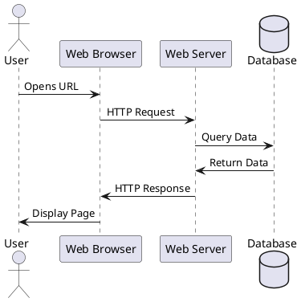
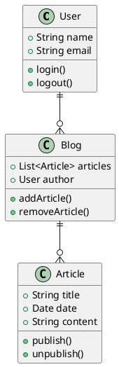
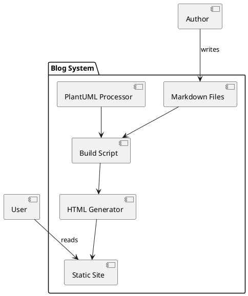

# Testing PlantUML Diagrams

This article demonstrates how PlantUML diagrams are automatically generated when building the site.

## Sequence Diagram

Here's a simple sequence diagram:

## Class Diagram

And here's a class diagram:

## Component Diagram

Finally, a component diagram showing the blog architecture:

The diagrams above are automatically generated from PlantUML code blocks during the build process!
